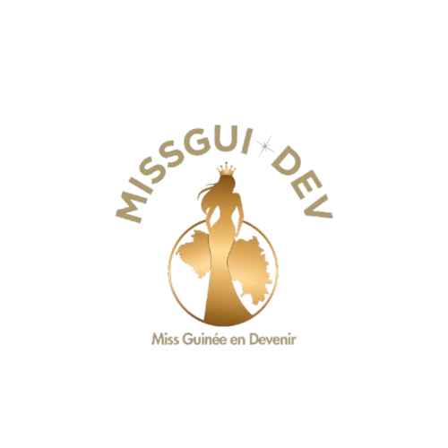

# 👑 MISSGUI DEV — Miss Guinée en Devenir



## 📖 À propos

**MISSGUI DEV — Miss Guinée en Devenir** est un site web vitrine dédié à la formation et à l'accompagnement des jeunes femmes guinéennes.

Le projet met en avant une vision basée sur quatre valeurs principales :

* ✨ Excellence
* 👑 Élégance
* 🎤 Leadership
* 🌍 Impact social

L'objectif est de présenter l'agence, ses services, ses candidates, ses actualités et de permettre aux candidates intéressées de déposer leur candidature.

---

## 🎯 Objectifs du site

Le site permet de :

* Présenter **MISSGUI DEV** et sa vision
* Présenter les différentes candidates
* Mettre en avant les services et formations proposés
* Publier des actualités et événements
* Permettre aux candidates de déposer une candidature
* Présenter les informations de contact
* Proposer une interface moderne, responsive et adaptée aux différents écrans

---

## 🖥️ Fonctionnalités

### 🏠 Accueil

Une section d'accueil présentant :

* La vision de MISSGUI DEV
* Un slogan principal
* Les principaux chiffres de l'organisation
* Un accès rapide aux candidatures
* Une présentation visuelle du projet

### 👩‍🎓 Nos candidates

Une section présentant plusieurs candidates avec :

* Leur photo
* Leur profil
* Leur domaine de mise en avant
* Une fenêtre modale permettant de consulter davantage de candidates

### 🎓 Services

Le site présente quatre domaines d'accompagnement :

1. **Formation**

   * Prise de parole
   * Posture
   * Culture générale
   * Préparation scénique

2. **Image & élégance**

   * Style
   * Présentation
   * Confiance en soi
   * Image publique

3. **Leadership**

   * Développement personnel
   * Leadership féminin
   * Prise de responsabilités

4. **Impact social**

   * Projets communautaires
   * Engagement social
   * Construction d'une cause personnelle

### 📰 Actualités

Une section dédiée aux actualités avec plusieurs articles :

* Lancement officiel de MISSGUI DEV
* Formation à la prise de parole
* Concours Miss Guinée en Devenir

Les articles peuvent être consultés dans des fenêtres modales.

### 📝 Candidature

Le site contient un formulaire permettant à une candidate de renseigner :

* Prénom
* Nom
* Email
* Téléphone
* Ville
* Âge
* Niveau d'étude
* Taille
* Motivation
* Consentement au traitement des informations

Le numéro de téléphone est limité à **9 chiffres**.

### 📱 Responsive Design

L'interface est conçue pour s'adapter aux différentes tailles d'écran et dispose notamment d'un menu mobile.

---

## 🛠️ Technologies utilisées

| Technologie      | Utilisation                                |
| ---------------- | ------------------------------------------ |
| **HTML5**        | Structure des pages                        |
| **CSS3**         | Mise en forme et responsive design         |
| **JavaScript**   | Interactions et fonctionnalités dynamiques |
| **EmailJS**      | Gestion de l'envoi du formulaire           |
| **Google Fonts** | Polices Playfair Display et Jost           |
| **Pexels**       | Images utilisées sur certaines sections    |

Le projet utilise notamment **Playfair Display** et **Jost** pour son identité visuelle.

---

## 📂 Structure du projet

```text
missgui-dev/
│
├── assets/
│   ├── logo.png
│   ├── groupe.png
│   └── ai.jpeg
│
├── css/
│   └── style.css
│
├── js/
│   └── script.js
│
├── index.html
│
└── README.md
```

---

## 🚀 Installation

### 1. Cloner le projet

```bash
git clone https://github.com/votre-utilisateur/missgui-dev.git
```

### 2. Entrer dans le projet

```bash
cd missgui-dev
```

### 3. Lancer le site

Le projet étant un site HTML/CSS/JavaScript, aucune installation de dépendances n'est nécessaire pour consulter l'interface.

Vous pouvez simplement ouvrir :

```text
index.html
```

dans votre navigateur.

Pour une meilleure expérience de développement, vous pouvez également utiliser **Live Server** avec Visual Studio Code.

---

## 📸 Aperçu

### Page d'accueil

Le site présente une interface élégante centrée sur l'identité de MISSGUI DEV, avec une mise en avant de la vision, des valeurs et des candidatures.

### Candidatures

La section candidature permet aux candidates de renseigner leurs informations et leur motivation.

---

## 📧 Contact

**MISSGUI DEV — Miss Guinée en Devenir**

📍 Conakry, Guinée

📧 [missguidev@gmail.com](mailto:missguidev@gmail.com)

📞 +224 620 00 00 00

---

## 👑 Vision

> **Révéler la beauté. Valoriser l'intelligence. Inspirer le changement.**

MISSGUI DEV souhaite accompagner les jeunes femmes guinéennes dans le développement de leur confiance, de leur leadership, de leur image et de leur engagement social.

---

## 📄 Licence

Ce projet est un projet personnel de présentation de **MISSGUI DEV — Miss Guinée en Devenir**.

Tous les contenus, visuels et éléments de marque appartiennent à leurs propriétaires respectifs.
